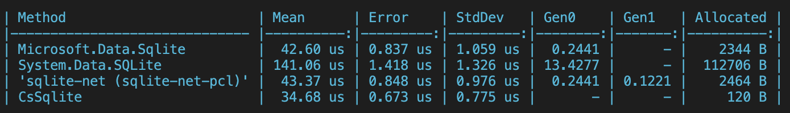

# CsSqlite
 Extremely fast, robust, and lightweight SQLite bindings for .NET and Unity

[](https://www.nuget.org/packages/CsSqlite)
[](https://github.com/nuskey8/CsSqlite/releases)
[](LICENSE)

English | [日本語](./README_JA.md)



CsSqlite is a highly performant and lightweight SQLite binding built in C#. It provides an API equivalent to [Microsoft.Data.Sqlite](https://learn.microsoft.com/en-us/dotnet/standard/data/sqlite/?tabs=net-cli) (the foundation package for EFCore SQLite) while achieving high performance through carefully tuned implementations.

## Features

* Easy-to-use API
* High-performance implementation leveraging `Span<T>` and `Unsafe`
* Zero allocation, no additional memory allocation
* No dependencies
* Robust binding generation using [Cysharp/csbindgen](https://github.com/Cysharp/csbindgen)
* Supports Unity (Mono, IL2CPP)

## Installation

### NuGet packages

CsSqlite requires .NET Standard 2.1 or later. The package is available on NuGet.

### .NET CLI

```ps1
dotnet add package CsSqlite
```

### Package Manager

```ps1
Install-Package CsSqlite
```

### Unity

For Unity, installation is possible via the Package Manager.

1. Open the Package Manager from Window > Package Manager
2. Click the "+" button > Add package from git URL
3. Enter the following URL:

```
https://github.com/nuskey8/CsSqlite.git?path=src/CsSqlite.Unity/Assets/CsSqlite.Unity
```

Alternatively, open `Packages/manifest.json` and add the following to the `dependencies` block:

```json
{
    "dependencies": {
        "com.nuskey.sqlite3.unity": "https://github.com/nuskey8/CsSqlite.git?path=src/CsSqlite.Unity/Assets/CsSqlite.Unity"
    }
}
```

CsSqlite.Unity supports the following platforms:

| Platform | Architecture            | Supported    | Notes |
| -------- | ----------------------- | ------------ | ----- |
| Windows  | x64                     | ✅            |       |
|          | x86                     | ✅            |       |
|          | arm64                   | ✅            |       |
| macOS    | x64                     | ✅            |       |
|          | arm64 (Apple Silicon)   | ✅            |       |
|          | Universal (x64 + arm64) | ✅            |       |
| Linux    | x64                     | ✅ (untested) |       |
|          | arm64                   | ✅ (untested) |       |
| iOS      | arm64                   | ✅            |       |
|          | x64                     | ✅            |       |
| Android  | arm64                   | ✅            |       |

## Quick Start

```cs
using CsSqlite;

// Open a SqliteConnection
using var connection = new SqliteConnection("example.db");
connection.Open();

// Execute SQL
connection.ExecuteNonQuery("""
CREATE TABLE IF NOT EXISTS user (
    id INTEGER NOT NULL PRIMARY KEY AUTOINCREMENT,
    age INTEGER NOT NULL,
    name TEXT NOT NULL
);
""");

// Overload accepting UTF-8 text
connection.ExecuteNonQuery("""
INSERT INTO user (id, name, age)
VALUES (1, 'Alice', 18),
       (2, 'Bob', 32),
       (3, 'Charlie', 25);
"""u8);

// Create a reader
using var reader = connection.ExecuteReader("""
SELECT name
FROM user
""");

// Read values using Read() / GetXXX(column)
while (reader.Read())
{
    Console.WriteLine($"{reader.GetString(0)}!");
}
```

## SqliteCommand

To reuse the same query, use `SqliteCommand`.

```cs
using var command = connection.CreateCommand("""
SELECT name
FROM user
""");

using var reader = command.ExecuteReader();
```

You can also add parameters to `SqliteCommand`.

```cs
using var command = conn.CreateCommand("INSERT INTO t(val) VALUES($foo);");
command.Parameters.Add("$foo", "foo");
command.ExecuteNonQuery();
```

## Exception Handling

If any error occurs during execution, a `SqliteException` is thrown. You can handle exceptions by catching this.

```cs
try
{
    // ...
}
catch (SqliteException ex)
{
    Console.WriteLine(ex.ErrorCode);
    Console.WriteLine(ex.Message);
}
```

## License

This library is provided under the [MIT License](LICENSE).